# KaarYab Afghanistan

KaarYab Afghanistan is a modern opportunity-finder platform built for Afghan job seekers, students, and organizations.
It helps people discover and manage jobs, internships, scholarships, remote work, online courses, training programs, volunteer work, and organization profiles in one place.

The project uses Supabase as its database, authentication, and storage backend, and it also supports PWA installation for a more app-like experience on supported devices.

The project is built with:

- Next.js 16 App Router
- React 19
- TypeScript
- Tailwind CSS 4
- next-intl for multilingual routing and translations
- Supabase for authentication, storage, and data persistence
- React Hook Form + Zod for forms and validation
- PWA support for installable mobile/desktop usage

This is not just a landing page. It is a real production-style web application with authentication, profile management, opportunity CRUD, saved items, organization pages, resume management, contact email delivery, and a reusable design system.

It was built to feel like a real product that could be used, deployed, and presented as a serious capstone project.

---

## Project Goals

KaarYab was created to solve a real problem in Afghanistan:

- opportunities are spread across many websites and social channels
- job seekers often need one clean place to browse and save opportunities
- many users want profile-based features like resumes, experience, education, certificates, and awards
- organizations need a way to share opportunities and be followed by users

The project aims to provide a simple, fast, accessible, and multilingual platform that feels like a real product.

---

## Live Product Features

### Opportunity Discovery

- Browse opportunities in card layout
- Search by keyword
- Filter by category, location, type, gender, and level
- Open dynamic opportunity detail pages
- View company summary, responsibilities, requirements, documents, tags, and apply links
- Save and unsave opportunities

### Opportunity Management

- Add new opportunities
- Edit existing opportunities
- Delete opportunities
- View recent submissions and stats in the dashboard

### Organization Directory

- Browse organizations, institutions, and countries
- Open organization detail pages
- Follow organizations
- View organization-related opportunities

### User Profile System

- Edit personal information
- Upload a profile avatar
- Pick country, nationality, gender, and date of birth using reusable controls
- Add work experience
- Add education
- Add certifications with attachments
- Add awards with attachments
- Add supporting documents
- Manage skills and languages as removable chips
- Auto-save profile changes

### Resume Builder

- Upload resume files
- Store resume links and file metadata
- Open and download uploaded files
- Delete stored resumes
- Choose resume template settings

### Authentication

- Real sign up and login with Supabase Auth
- Session-aware user state
- Auth-dependent profile and storage features

### Contact Form

- Fully functional contact form
- Sends messages through a server endpoint
- Uses Resend for email delivery

### PWA Support

- Web app manifest
- App icon and splash-friendly assets
- Service worker registration
- Installable experience on supported browsers
- Offline-friendly caching for core navigational assets

---

## Main Pages

Locale-aware routes are the primary public routes.

### Public and App Pages

- `/[locale]` - localized home page
- `/[locale]/dashboard` - dashboard with summaries and recent items
- `/[locale]/opportunities` - opportunity browser
- `/[locale]/opportunities/[id]` - opportunity details
- `/[locale]/opportunities/[id]/edit` - edit opportunity
- `/[locale]/add-opportunity` - create opportunity form
- `/[locale]/saved` - saved opportunities
- `/[locale]/organizations` - organization directory
- `/[locale]/organizations/[slug]` - organization detail page
- `/[locale]/profile` - user profile and resume data
- `/[locale]/resume-builder` - resume upload and management
- `/[locale]/settings` - user settings
- `/[locale]/about` - about page
- `/[locale]/contact` - contact form
- `/[locale]/login` - login page
- `/[locale]/signup` - sign up page

### Compatibility Routes

The app currently keeps root-level routes as well for compatibility and routing flexibility.
Locale-aware routes remain the preferred structure.

---

## Tech Stack

- Next.js 16
- React 19
- TypeScript
- Tailwind CSS 4
- next-intl
- Supabase Auth
- Supabase Storage
- Supabase database tables
- React Hook Form
- Zod
- Resend

---

## Architecture Overview

### App Router Structure

The project uses the Next.js App Router with localized layout support:

- `src/app/layout.tsx` handles global document setup, metadata, bootstrap loading, and providers
- `src/app/[locale]/layout.tsx` handles locale-aware client translation context and shell composition
- `src/app/loading.tsx` provides a modern loading state
- `src/app/manifest.ts` generates the web manifest
- `src/app/page.tsx` and other pages compose the actual route content

### Context and State

The app uses split context providers instead of one giant state container:

- `AuthContext`
- `ProfileContext`
- `OpportunitiesContext`
- `ThemeContext`

This keeps rerenders lower and makes each concern easier to maintain.

### Data and Persistence

Persistent data is synced through Supabase:

- authentication sessions
- profile data
- opportunity data
- saved opportunities
- followed organizations
- avatar uploads
- resume uploads
- certification and award attachments

### Reusable UI Layer

The project uses shared building blocks for consistency:

- `SearchableSelect`
- `DatePickerField`
- `FormField`
- shared dialog shells
- profile sections
- dashboard cards
- opportunity cards
- common buttons and panels

---

## Multilingual Support

The project supports:

- English
- Dari
- Pashto

Implemented with:

- `next-intl`
- locale-aware routing
- locale-aware metadata
- RTL/LTR direction handling
- language switcher in the app shell

The app is designed so that the UI direction and translated content follow the selected locale.

---

## PWA Support

The app includes PWA support through:

- `manifest.webmanifest`
- app icons
- service worker registration
- installable standalone mode

Notes:

- PWA installation works best on HTTPS production deployments
- local development may not fully reflect install behavior

---

## Supabase Integration

Supabase is used for:

- authentication
- user profile persistence
- opportunity data sync
- saved opportunities
- followed organizations
- avatar storage
- resume storage
- profile attachment storage

### Storage Buckets

Recommended buckets:

- `avatars`
- `resumes`
- `profile-attachments`

### Database Tables

The app syncs with tables such as:

- `profiles`
- `experience_entries`
- `education_entries`
- `certification_entries`
- `award_entries`
- `document_entries`
- `opportunities`
- `saved_opportunities`
- `followed_organizations`

---

## Environment Variables

Create a `.env.local` file:

```bash
NEXT_PUBLIC_SUPABASE_URL=your-supabase-project-url
NEXT_PUBLIC_SUPABASE_ANON_KEY=your-supabase-anon-key
NEXT_PUBLIC_SUPABASE_AVATAR_BUCKET=avatars
NEXT_PUBLIC_SUPABASE_AVATAR_BUCKET_PUBLIC=false
NEXT_PUBLIC_SUPABASE_RESUME_BUCKET=resumes
NEXT_PUBLIC_SUPABASE_RESUME_BUCKET_PUBLIC=false
NEXT_PUBLIC_SUPABASE_PROFILE_ATTACHMENT_BUCKET=profile-attachments
NEXT_PUBLIC_SUPABASE_PROFILE_ATTACHMENT_BUCKET_PUBLIC=false
NEXT_PUBLIC_SITE_URL=http://localhost:3000
RESEND_API_KEY=your_resend_api_key
CONTACT_TO_EMAIL=your_inbox@example.com
CONTACT_FROM_EMAIL=KaarYab Afghanistan <onboarding@resend.dev>
```

If you have verified your own Resend domain, replace `CONTACT_FROM_EMAIL` with an address from that verified domain.

---

## Recommended Supabase Setup

### Authentication

- Enable email/password auth
- Configure email confirmation if needed

### Storage Policies

Recommended behavior:

- users can upload only their own avatar files
- users can upload only their own resume files
- users can upload only their own certification/award/document attachments
- users can read and delete only their own files

### Profile Persistence

The profile system stores:

- name
- headline
- avatar
- country / province / nationality
- date of birth / gender / address
- summary
- skills / languages
- experience / education
- certifications / awards / documents
- social links
- resume data

The app auto-saves profile changes and also flushes the latest profile state before sign out.

---

## Folder Structure

```text
src/
  app/
  components/
    common/
    layout/
    profile/
    opportunities/
    dashboard/
    auth/
    ui/
  config/
  context/
  data/
  hooks/
  i18n/
  lib/
  messages/
public/
```

### Important Areas

- `src/app` - route files and layouts
- `src/components` - reusable UI and feature views
- `src/context` - split React contexts
- `src/hooks` - data/bootstrap/profile/auth/theme hooks
- `src/lib` - Supabase helpers, app state, schemas, utilities
- `src/i18n` - locale config, routing, navigation helpers
- `src/messages` - translation dictionaries

---

## Design System

The UI uses a compact design system with shared visual tokens and repeated components.

### Shared Patterns

- consistent border radius
- consistent card shadows
- compact input styling
- gradient accents
- reusable chip and badge styles
- modern loading and empty states

### Shared Controls

- `SearchableSelect` for modern dropdowns
- `DatePickerField` for modern date pickers
- `FormField` for labels, hints, and validation messages
- profile dialog shells for add/edit modals

---

## Screenshots and Brand Assets

> Replace the placeholder image paths below with your own screenshots before final submission.

### Submission Links

- Deployed App: `PUT_DEPLOYED_VERCEL_LINK_HERE`
- Demo Video: `PUT_DEMO_VIDEO_LINK_HERE`
- GitHub Repository: `PUT_GITHUB_REPOSITORY_LINK_HERE`

### Screenshots

### Design System Preview


### Home Page

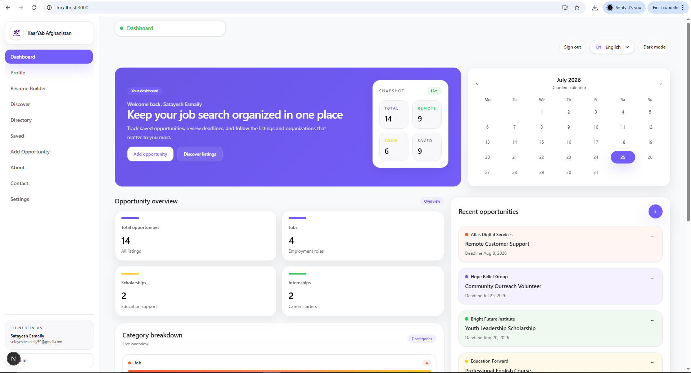

### Opportunities Page

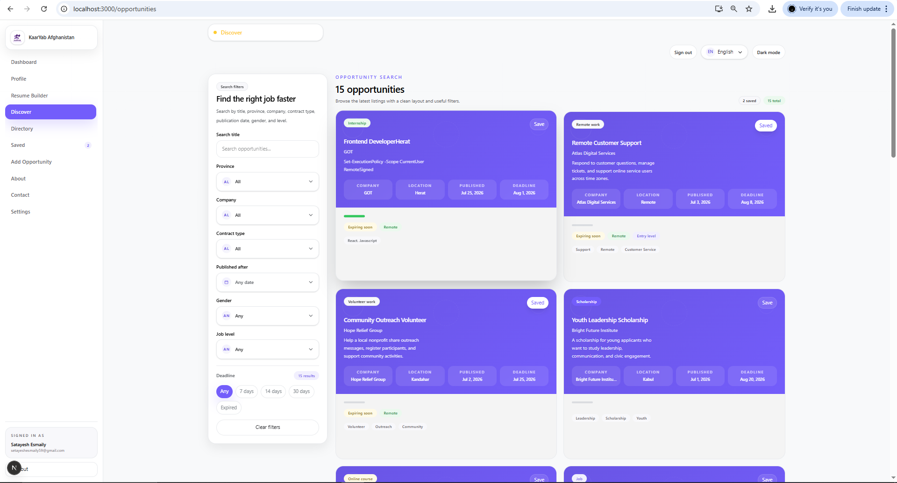

### Opportunity Details Page

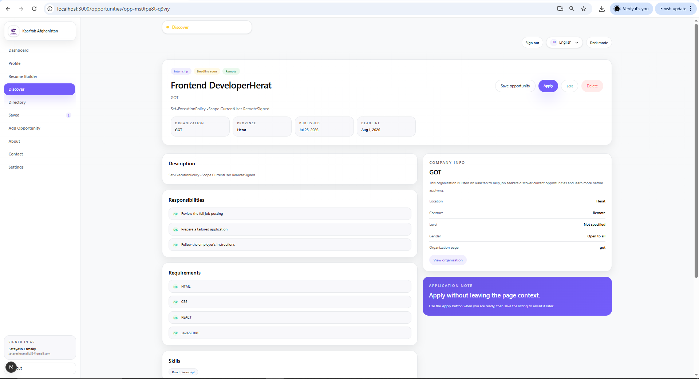

### Dashboard Page


### Add Opportunity Page

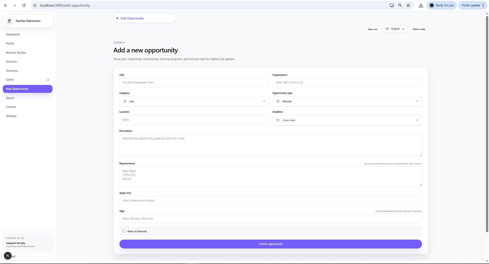

### Saved Page

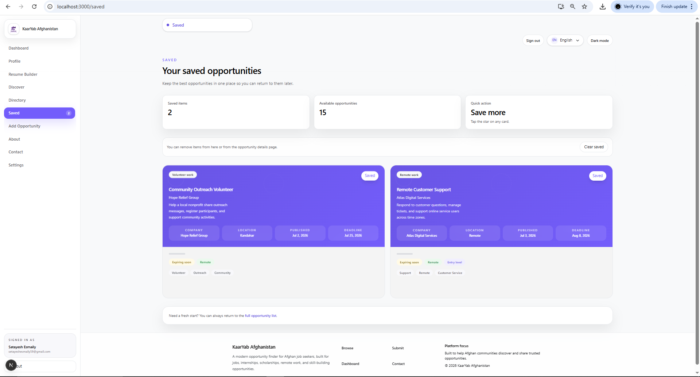

### Organizations Page

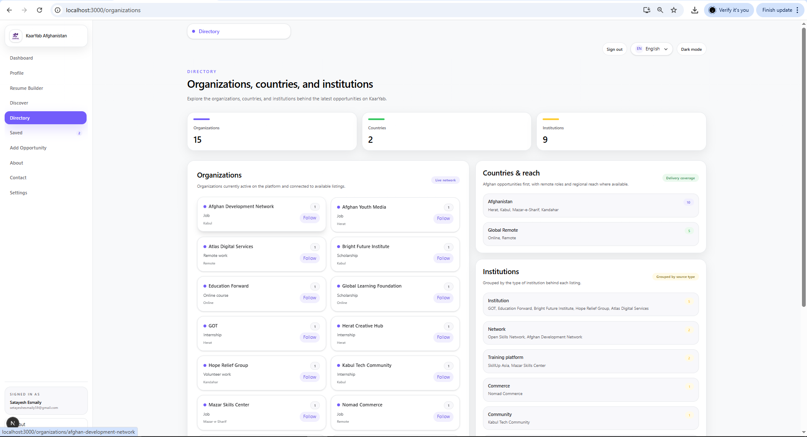

### Profile Page

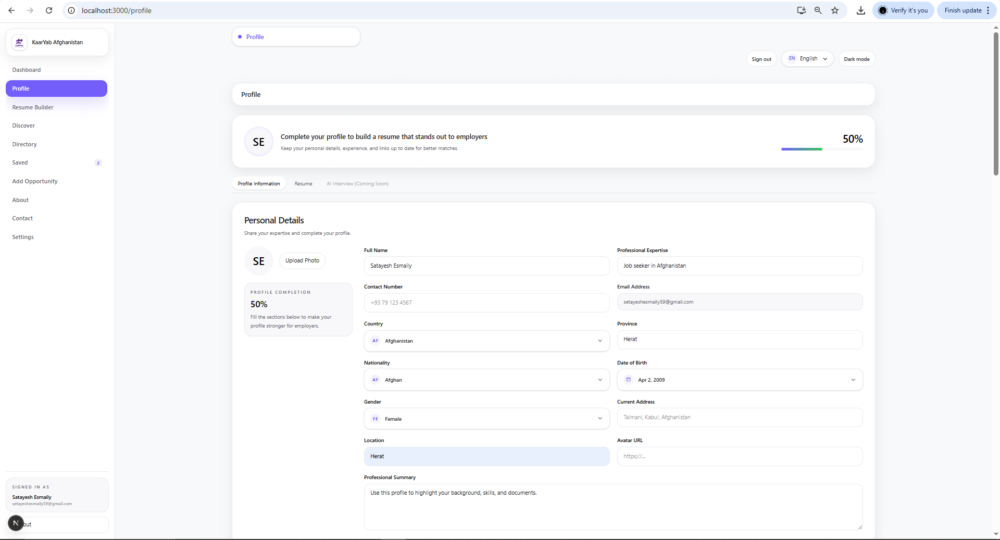

### Resume Builder Page

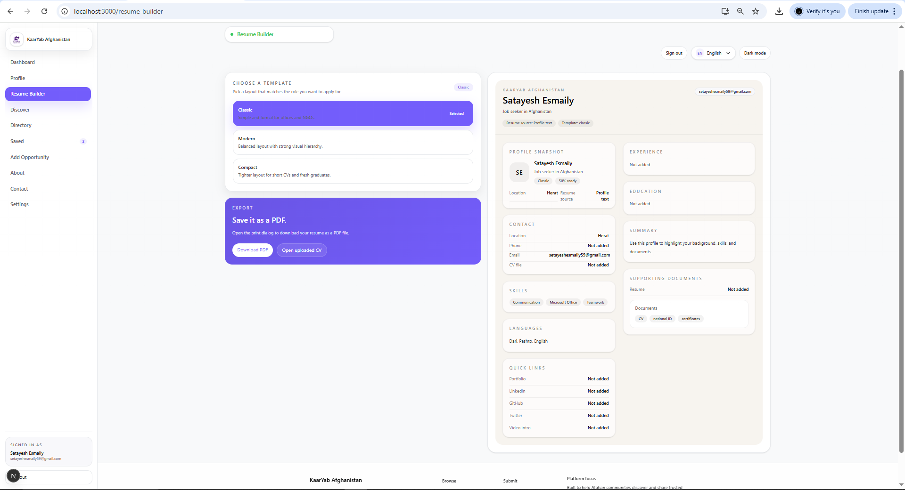

### Contact Page

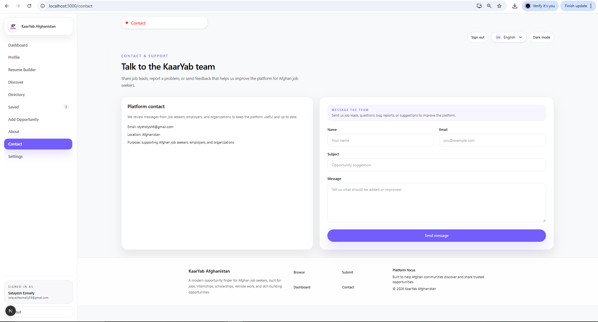

### Login and Signup Pages

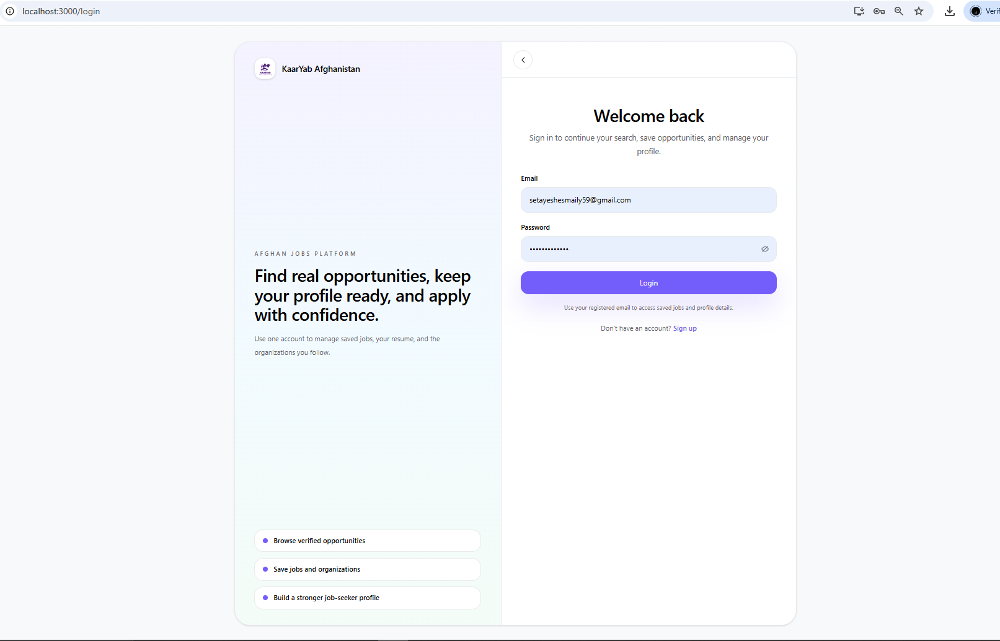

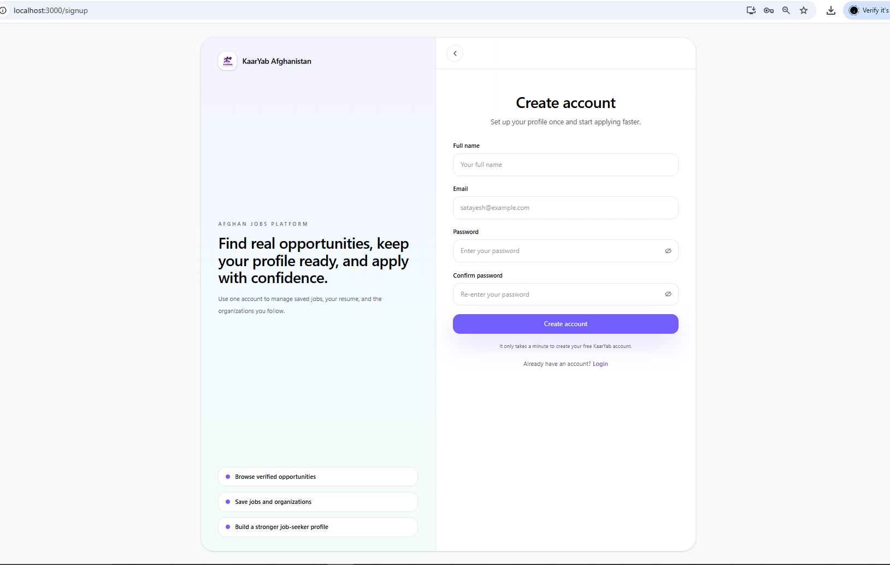

### Brand Assets


---

## Local Development

### Install

```bash
npm install
```

### Development Server

```bash
npm run dev
```

Open:

```text
http://localhost:3000
```

### Production Build

```bash
npm run build
```

### Start Production Server

```bash
npm run start
```

### Lint

```bash
npm run lint
```

---

## Testing Checklist

- Open the home page
- Switch between languages
- Search and filter opportunities
- Open an opportunity detail page
- Add, edit, and delete an opportunity
- Save and unsave an opportunity
- Log in and sign up with Supabase
- Update the profile
- Upload a profile photo
- Upload a resume
- Add experience, education, certifications, awards, and documents
- Open organization detail pages
- Test the app on mobile and tablet layouts
- Build the project with `npm run build`

---

## Deployment

Recommended deployment target:

- Vercel

Before deployment, make sure you add all Supabase and Resend environment variables in the hosting dashboard.

The app is designed to run with:

- HTTPS
- locale-aware URLs
- manifest support
- service worker support

---

## Future Improvements

- richer resume builder templates
- deeper organization analytics
- more advanced notification flows
- broader server-side persistence for every collection
- stronger testing coverage
- additional accessibility polish
- more SEO enhancements for large-scale search indexing
- admin moderation tools for submitted opportunities
- improved analytics for dashboard insights
- richer organization follow notifications
- more advanced email templates for contact and notifications
- stronger offline-first behavior for the PWA

---

## Demo Data

The app still includes demo opportunities and sample content for local development and presentation.
Even with real auth and storage enabled, demo data remains useful for first-load experience and showcasing the interface.

---

## Why This Project Stands Out

This project goes beyond a normal student final project because it includes:

- real authentication
- real storage
- multilingual routing
- RTL/LTR support
- PWA support
- reusable architecture
- modern dashboard UI
- profile system with attachments
- resume management
- email contact flow
- production-ready metadata

---

## Presentation Summary

If you need to present the project, explain it like this:

1. KaarYab helps Afghan users discover opportunities in one platform.
2. It supports jobs, internships, scholarships, remote work, and training.
3. Users can browse, search, save, follow, and manage opportunities.
4. Registered users can edit a profile, upload files, and manage their resume.
5. The app supports English, Dari, and Pashto.
6. Data is stored with Supabase and the app is installable as a PWA.

---

## License

MIT License

Copyright (c) 2026 KaarYab Afghanistan

Permission is hereby granted, free of charge, to any person obtaining a copy
of this software and associated documentation files (the "Software"), to deal
in the Software without restriction, including without limitation the rights
to use, copy, modify, merge, publish, distribute, sublicense, and/or sell
copies of the Software, and to permit persons to whom the Software is
furnished to do so, subject to the following conditions:

The above copyright notice and this permission notice shall be included in all
copies or substantial portions of the Software.
